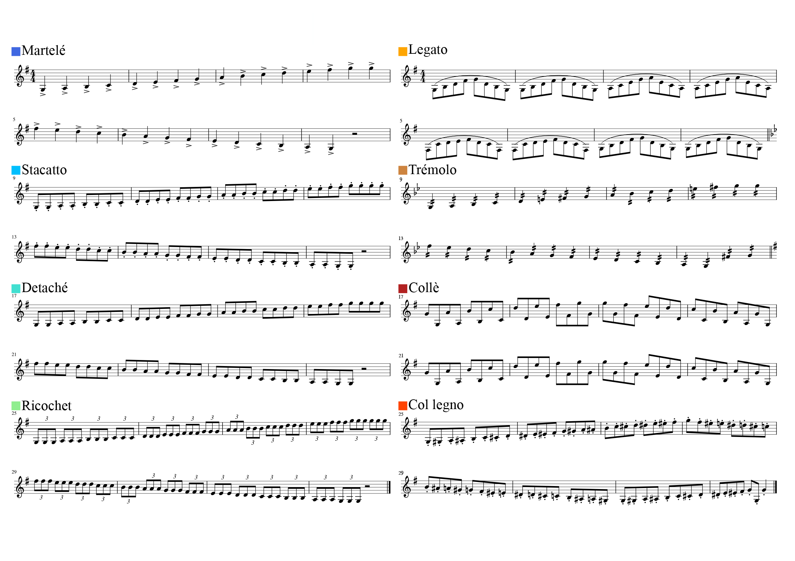
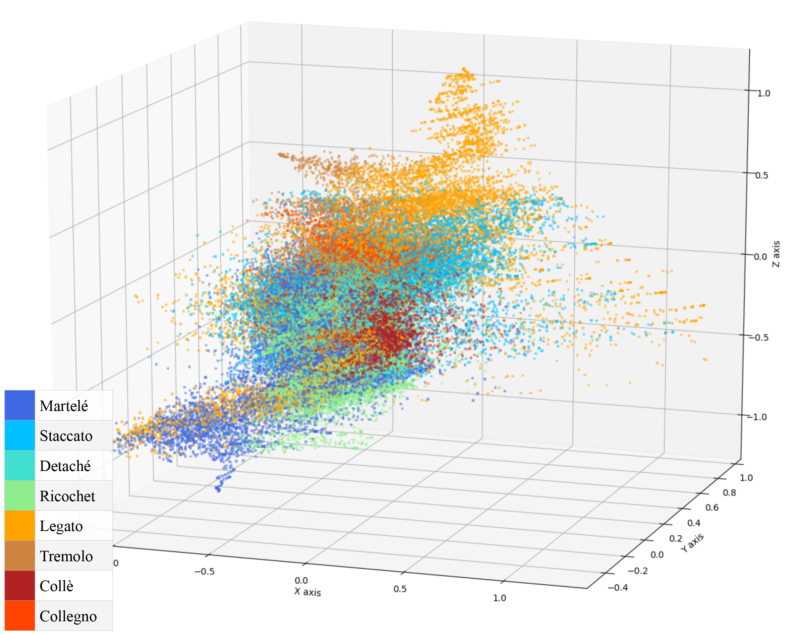
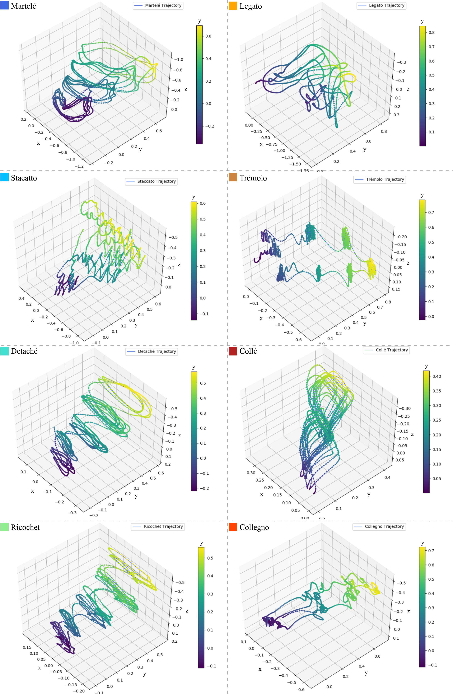
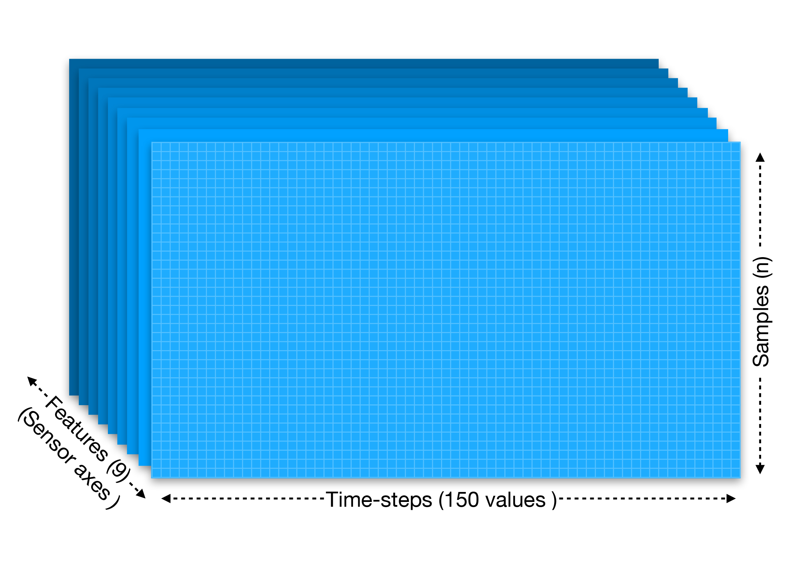

# Deep Learning Techniques Applied to Estimate Music Gestural Patterns
The following code provide all the Deep Learning techniques applied in the paper using Keras framework. 

### The paper is available here:
[Applying Deep Learning Techniques to Estimate Patterns of Musical Gesture](https://www.frontiersin.org/articles/10.3389/fpsyg.2020.575971/full)

We used: 
- Python '3.6.8' 
- TensorFlow '2.0.0' 
- NumPy '1.17.4' 
- Scikit-learn '0.23.1' 
- Pyquaternion '0.9.5'.

## Music Material
Eight bow-strokes were recorded by musicians following a musical score with a fixed metronome tempo of quarter-notes at 80 bpm. All gestures were established in G, primarily in the major mode except for tremolo (G minor) and col legno (chromatic). On the violin, two octaves from G3 to G5 covers the whole neck and also all four strings. Eight musicians participated in the recording sessions, with expert models constructed using the data from five violinists; the other three participants were reserved as test cases. The recordings are part of a collaboration with the Royal College of Music in London.

## Cluster Data
All the samples as a 3D representation cluster after translating the Quaternion data into Euler angles:

## Gesture Trajectories
We have eight different patterns after translating the Quaternion data into Euler Angles:

## 3D Data Format
The shape of the 3D data to be passed to the LSTM models is given by (Samples, Time-steps, Features). As you might see in the data/Gestures/All folder, features are organised in independent files from 1 to 9 wich each of them are the axes per sensor device (Accelerometer, Gyroscope and Magnetometer).

